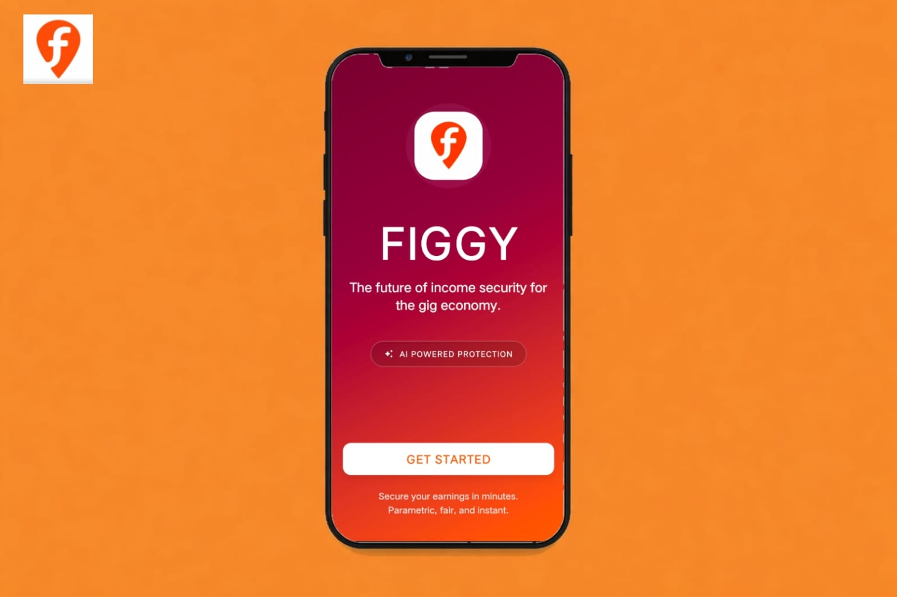
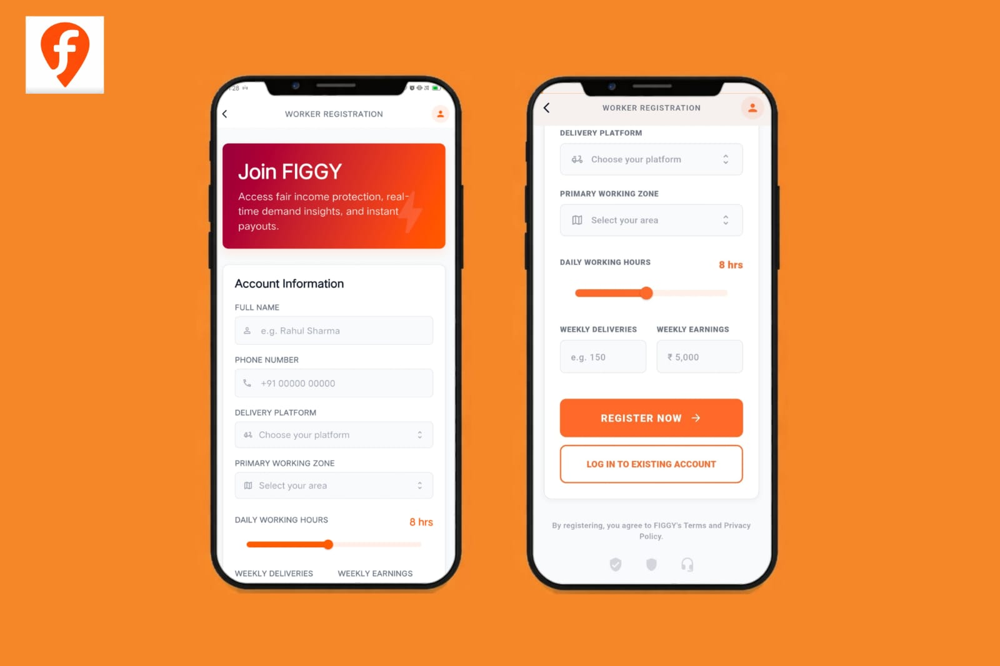
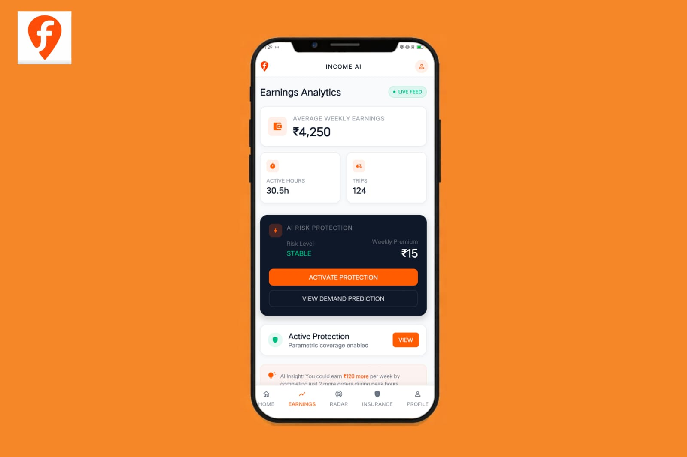
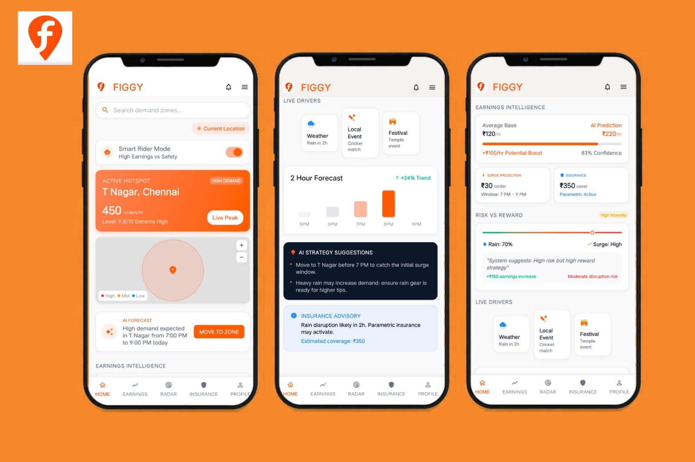
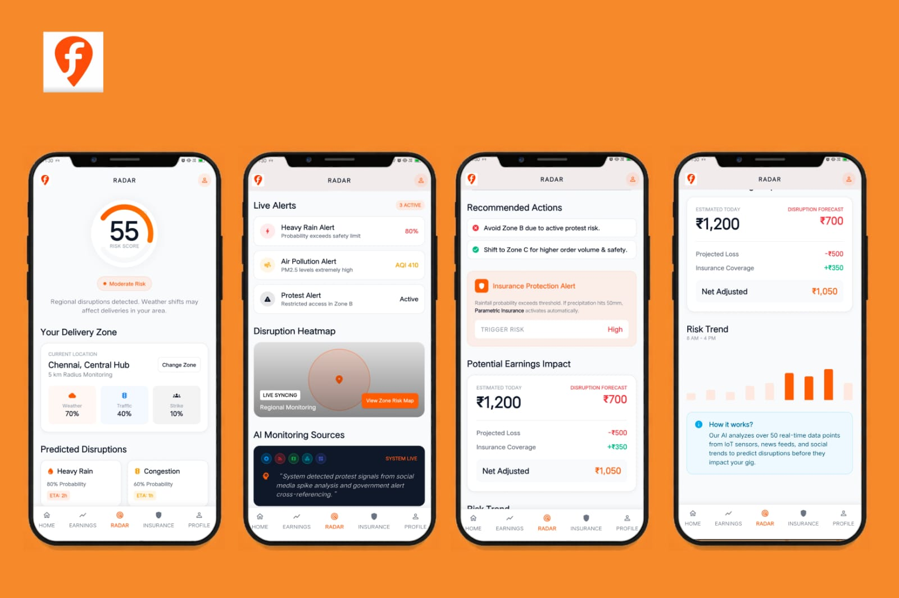
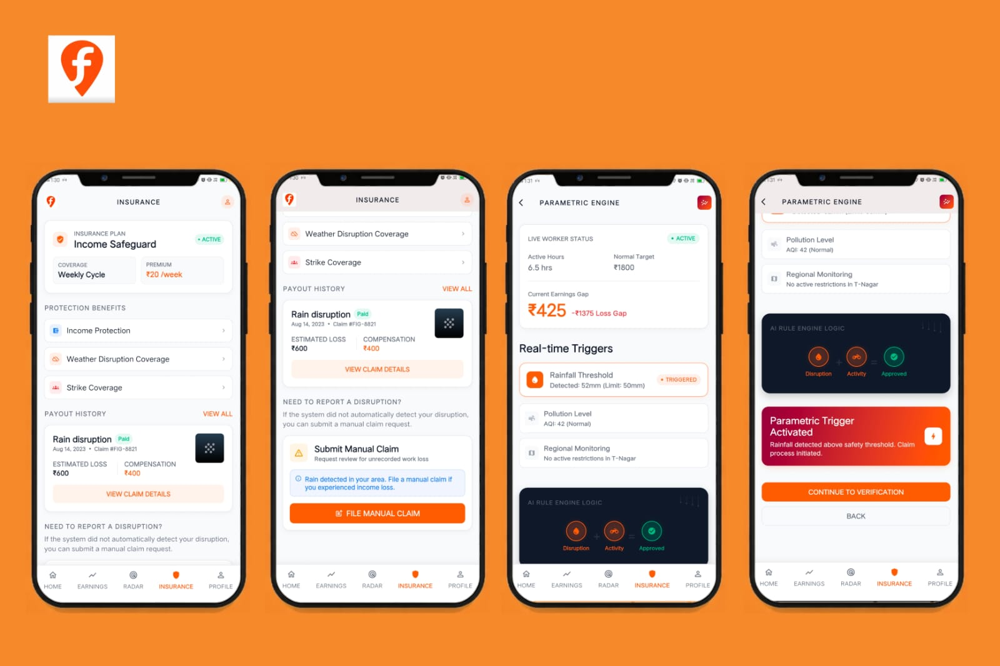
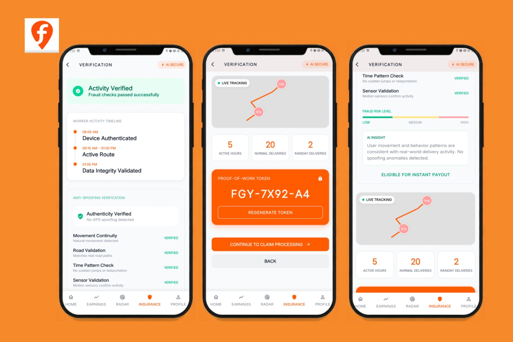
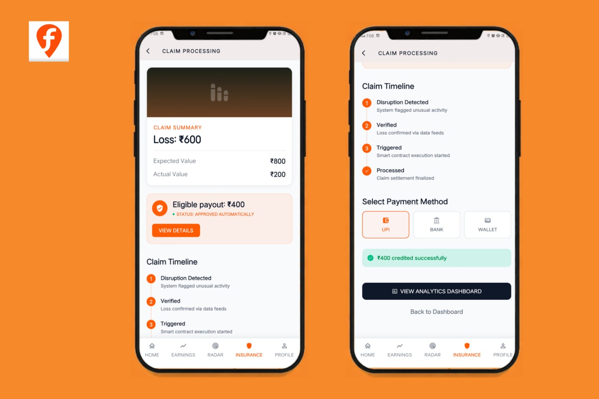
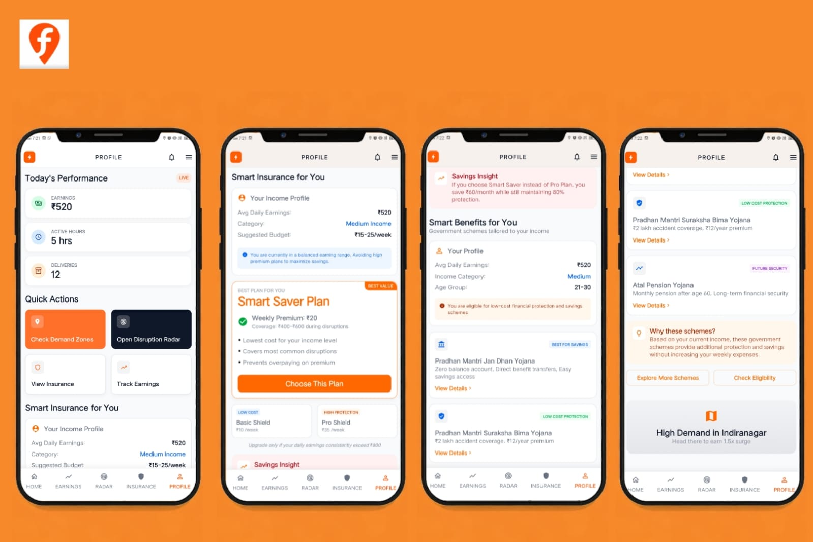
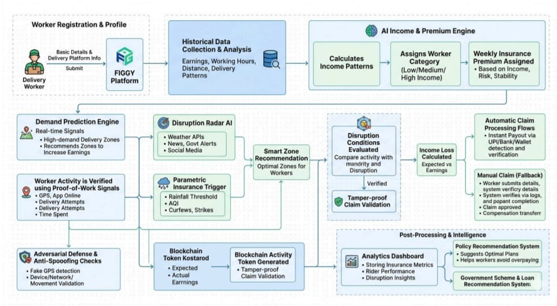

  

<h1 align="center">FIGGY</h1>

  <strong>AI-Powered Parametric Income Insurance for Gig Workers</strong> 
  Protecting delivery partners from income loss with automated, data-driven insurance payouts.

---
## 🎯 **Target Persona**
**Primary User:** Delivery partners working on platforms like Swiggy

---
## 📖 **Overview**
FIGGY is an AI-powered parametric insurance platform designed to protect gig workers, especially delivery partners, from income loss caused by external disruptions such as heavy rain, floods, pollution, strikes, or curfews.
Unlike traditional insurance systems that require manual claim filing and long verification processes, FIGGY automatically detects disruptions using real-world data and triggers instant payouts when workers experience income loss.
The system also includes AI-based demand prediction to guide workers toward high-demand delivery zones, helping them maximize earnings even before disruptions occur.

---
## ⚠️ **Problem Statement**

India's gig economy is rapidly growing, with millions of delivery partners working for platforms such as:

*   Swiggy
*   Zomato
*   Zepto
*   Amazon

These workers depend entirely on daily deliveries for income. However, external disruptions such as:

*   Heavy rainfall
*   Flooding
*   Severe air pollution
*   Local strikes or protests
*   Government curfews

can reduce their working hours and earnings by 20-30%. Currently, gig workers have no financial safety net for such situations.

**FIGGY** addresses this gap by providing automated parametric insurance and AI-driven income optimization.

---
## 👤 **Target Persona**
### **Example Worker Persona**

*   **Name:** Ravi
*   **Role:** Delivery Partner
*   **Location:** Chennai - T Nagar Zone
*   **Working Hours:** 6 hours/day
*   **Average Earnings:** ₹800/day

### **Key Challenges**
*   Earnings fluctuate due to weather disruptions
*   Idle time when demand is low
*   No compensation for lost working hours
*   No insurance support for gig workers
### **FIGGY helps workers by providing:**
*   Income prediction & Disruption protection
*   Smart delivery zone recommendations
*   Automatic insurance payouts

---
## 💡 **Our Solution - FIGGY**
FIGGY introduces a parametric insurance system powered by AI and blockchain that automatically protects gig workers during disruptions.
### **It Provides:**
1️⃣ **Income Optimization:** Predicts high demand zones so riders earn more.
2️⃣ **Income Protection:** Automatically compensates workers when external disruptions reduce earnings.
3️⃣ **Fraud-Resistant Insurance:** Uses AI behavior verification + proof-of-work activity tokens.

---

  

## 🏗️ **System Architecture Overview**
The platform consists of 8 major modules:
*   Worker Onboarding System
*   AI Income & Premium Engine
*   Food Demand Prediction Engine
*   Disruption Radar AI
*   Parametric Insurance Engine
*   Proof-of-Work Fraud Detection System + Adversarial Defense & Anti-Spoofing Strategy
*   Automated Claim & Payout System
*   Analytics Dashboard + policy matching

---
## ✨ **Key Features**
### **1. Worker Onboarding**
A Swiggy delivery partner registers on the Figgy platform.
#### **Data Collected:**
*   Worker ID
*   Delivery platform
*   Working zone
*   Historical delivery data
*   Average earnings
*   Weekly working hours

#### **Example Activity Log:**

| Day       | Hours | Distance | Earnings |
| :-------- | :---: | :------: | :------- |
| Monday    |   5   |  20 km   | ₹600     |
| Tuesday   |   8   |  40 km   | ₹1100    |
| Wednesday |   4   |  15 km   | ₹450     |
| Thursday  |   7   |  35 km   | ₹950     |
| Friday    |   6   |  28 km   | ₹800     |

---

  

### **2. AI Income & Premium Engine**
The AI Income Engine analyzes historical worker activity to estimate average earnings and determine a fair insurance premium.
#### **Factors Analyzed:**
*   Average working hours
*   Number of completed deliveries
*   Distance traveled
*   Historical earnings patterns
*   Zone-based risk levels

#### **AI Models Utilized:**
*   **Random Forest** - Worker activity pattern analysis
*   **Gradient Boosting** - Income prediction
*   **XGBoost** - Structured data risk scoring

This ensures the premium system remains fair and affordable.

#### **Weekly Premium Model**

FIGGY calculates weekly insurance premiums dynamically.

#### **Parameters Used:**
*   Average weekly income
*   Delivery frequency
*   Income stability
*   Location risk levels
*   Disruption probability

#### **Premium Structure:**

| Income Level   | Weekly Premium |
| :------------- | :------------: |
| Low Income     |      ₹10       |
| Medium Income  |      ₹20       |
| High Income    |      ₹35       |

---

  

### **3. Area Demand Prediction Engine**
The Demand Prediction Engine analyzes real-time signals (weather, events, order trends) to identify zones with high demand. When worker availability drops but demand remains high, the system recommends these zones, enabling riders to earn higher incentives.
#### **AI Integration:**
*   **XGBoost** - Demand prediction
*   **Random Forest** - Demand signal analysis
*   **LSTM** - Time-based trend learning
*   **Prophet** - Time-series forecasting

#### **Example: Cricket Stadium Demand Surge with Disruption**
*   During an IPL match at a cricket stadium, fans create a sudden spike in food orders nearby.
*   At the same time, heavy rain or traffic congestion reduces the number of active delivery partners (disruption).
*   The system detects this **high-demand + high-disruption zone**, recommends it to riders with higher incentives, ensuring deliveries continue while riders earn more.

---

  

### **4. Disruption Radar AI**
Detects external disruptions affecting deliveries and predicts their impact using Weather APIs, Government alerts, News feeds, and Social media signals.
#### **AI Models:**
*   Transformer-based NLP models
*   Event detection algorithms
*   Risk classification models

#### **Disruption Risk Score**
The system calculates a risk score for each delivery zone.  
*Example: Zone B protest probability = 78%*

#### **Rider Location Monitoring**
The system checks the current location of riders and alerts them if they are in a high-risk zone.  
*Example alert: "High disruption risk detected in your area due to heavy rain."*

#### **Smart Zone Recommendation**
By combining demand prediction and disruption analysis, FIGGY recommends zones that:
*   Have higher delivery demand
*   Have lower disruption risk
*   Offer better earning potential

#### **Income Loss Prediction**
When disruptions occur, FIGGY estimates income loss by comparing:  
**Expected Earnings vs Actual Earnings**

*Example:*  
Expected earnings = ₹800  
Actual earnings = ₹250  
**Income Loss = ₹550**

#### **System Actions:**
*   Notify riders about disruptions
*   Suggest safer delivery zones
*   Estimate income loss
*   Prepare parametric insurance payouts

---

  

### **5. Parametric Insurance Triggers**
Insurance payouts are automatically triggered when thresholds are detected: Rainfall > 40 mm/hour, AQI > 400, or Government curfews/protests. The system verifies worker activity and initiates the payout automatically.

---

  

### **6. Proof-of-Work Activity Verification**
Verifies genuine activity using GPS movement, app online status, delivery attempts, and time spent in zones.
#### **Blockchain-Based Activity Token:**
Stored on blockchain with Worker ID, zone, active hours, attempts, environmental conditions, and timestamp.
#### **Benefits:**
Tamper-proof records, transparent verification, and secure claim validation.
#### **Claim Trigger Logic:**
Payouts are triggered when **External Disruption** (e.g., Heavy rain) and **Verified Activity** (e.g., Active 5 hrs with low deliveries) are both met.
#### **Adversarial Defense & Anti-Spoofing Strategy:**
FIGGY uses a Behavioral Trust Engine to prevent GPS spoofing by checking movement continuity, road validation, time-based patterns, and device sensor data (accelerometer/gyroscope).
#### **Risk Handling:**

| Risk Level | System Action                           |
| :--------- | :-------------------------------------- |
| Low        | Instant payout                          |
| Medium     | Soft verification (live location check) |
| High       | Claim flagged for manual review         |

---

  

### **7. Automated Claim Processing & Payment**

Once disruption detection and worker activity verification are completed, FIGGY automatically processes the insurance payout.

#### **Process Flow:**
*   Disruption detected by the system
*   Worker activity verified through Proof-of-Work
*   Income loss calculated using expected vs actual earnings
*   Smart contract triggers automatic payout

#### **Example Payout:**
Expected Earnings: ₹800  
Actual Earnings: ₹200  
Loss = ₹600  
**Eligible Payout = ₹400**

#### **Payment Methods:**
*   UPI
*   Bank transfer
*   Wallet credit

This enables fast, transparent, and frictionless claim settlement.

#### **Manual Insurance Claim Fallback**

Although FIGGY primarily relies on automatic parametric triggers, workers can also submit manual claims when automated detection fails.

#### **Situations for Manual Claims:**
*   API failures
*   Undetected local disruptions
*   Technical system issues
*   Internet outages affecting monitoring

#### **Manual Claim Process:**
*   Worker opens the FIGGY app
*   Navigates to Insurance Claims
*   Selects Submit Manual Claim
*   Provides Details:
    *   Delivery zone
    *   Time of disruption
    *   Event description
    *   Optional proof

#### **Verification:**
The system verifies worker activity logs, GPS movement, and delivery attempts. If verified, the claim is approved and payout is processed.

---

  

### **8. Analytics Dashboard**

Provides real-time insights into platform performance and worker impact.

#### **Insurance Metrics:**
*   **Active Workers** - Number of gig workers currently enrolled
*   **Premium Pool** - Total premiums collected in the system
*   **Claims Triggered** - Number of insurance claims processed
*   **Fraud Cases Prevented** - Fraudulent claims blocked using verification mechanisms

---

  

## 🏗️ **Tech Stack**

### 📱 **Frontend (Mobile App)**
*    **Flutter** |  **Dart** | **Flutter Material UI**
### ⚙️ **Backend & Infrastructure**
*    **Node.js / Express** |  **Docker** |  **AWS / Google Cloud**
### 🧠 **AI & Data Processing**
*    **Python** (Scikit-learn, TensorFlow, Prophet)
### 🗄️ **Database**
*    **PostgreSQL** |  **Redis** |  **Ethereum / Polygon** (Smart Contracts)
### 🔌 **External Integrations**
*   **APIs:** Weather API, Maps API, Payment Gateway (UPI/Bank)

---

## 🔄 **How It Works (End-to-End Workflow)**

1.  **Registration:** Worker registers on FIGGY, providing basic details and delivery platform info.
2.  **Analysis:** Historical delivery data (earnings, hours, distance) is collected and analyzed.
3.  **Income Profiling:** AI Engine calculates income patterns and assigns a worker category (Low/Medium/High).
4.  **Premium Assignment:** A weekly insurance premium is assigned based on income level and risk.
5.  **Optimization:** Demand Prediction Engine identifies high-demand zones and suggests them to the worker.
6.  **Monitoring:** Disruption Radar AI monitors weather, news, and social media for disruptions.
7.  **Smart Routing:** Recommends optimal zones by combining demand and disruption data.
8.  **Trigger Evaluation:** Monitors parametric thresholds (Rainfall, AQI, Curfews).
9.  **Verification:** Uses Proof-of-Work signals (GPS, online status, attempts) to verify activity.
10. **Security:** Applies Anti-Spoofing and Adversarial Defense checks.
11. **Tokenization:** Generates a secure Blockchain Activity Token for the work session.
12. **Settlement:** Calculates income loss and triggers automatic payout if conditions are met.

  

---

## 🚀 **Future Scope**

*   Expand to other gig sectors (ride-sharing, taskers, etc.)
*   Integrate with specialized government schemes:
    *   **Pradhan Mantri Jan Dhan Yojana**
    *   **Pradhan Mantri Suraksha Bima Yojana**
    *   **Atal Pension Yojana**
*   Introduce micro-loan recommendation systems based on worker consistency.
*   Enhance AI models for hyperlocal weather prediction.

---

## 🛠️ **Installation / Setup**

*Information regarding local setup and deployment is currently being finalized. This project focuses on system architecture and AI model validation.*

---

## 📈 **Expected Impact**

*   Reduces income loss during disruptions by 20-30%.
*   Provides instant payouts without manual claim delays.
*   Increases earnings through intelligent demand prediction.
*   Ensures transparency and fraud prevention via blockchain.

---

## 🙏 **Gratitude**

**Taking a moment to show gratitude to Guidewire for organizing these types of hackathons.** It provides an incredible platform for innovation and learning! 

---

## 📄 **License & Submission**

*   **License:** [[MIT]] - © 2026 **FIGGY**
*   **Submission:** GuideWire DevTrails University Hackathons
*   **Team:** Hacker Squad
*   **Motto:** *Built for India's Gig Workers - FIGGY* 🚀